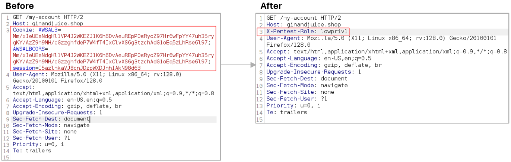
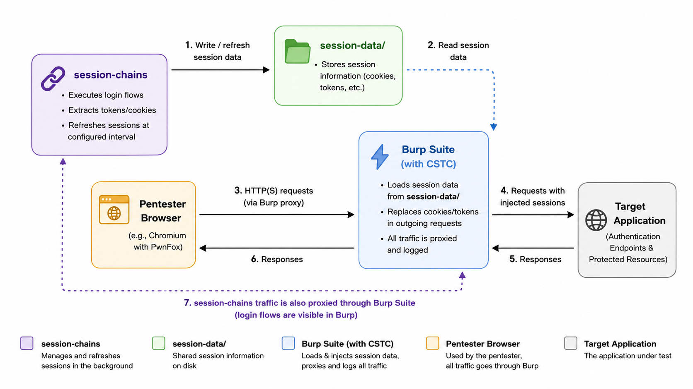
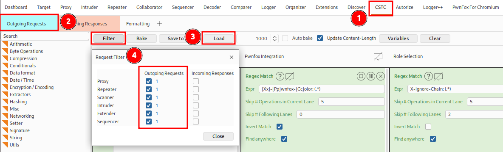

# Session‑Chains
`session-chains` automates maintaining and refreshing multiple authenticated sessions with minimal effort.
It allows to define complex login flows, including for example multi-step authentication or TOTPs.
This makes it ideal for pentesting by easily switching between accounts or roles without ever loosing the active sessions.
`session-chains` integrates with BurpSuite by using the [Cyber-Security Transformation Chef extension](https://github.com/usdag/cstc) and allows to automatically manage sessions in differently colored browser windows when used in combination with *PwnFox for Chromium*.

## Features

Once configured (see detailed instructions in [Getting Started](#Getting-Started)), `session-chains` has the following features:

1. Sessions for all configured users are kept-alive automatically for all traffic through BurpSuite proxy
2. Switch between different users (and thus roles) with a simple HTTP header `X-Pentest-Role`. This simplifies testing for access-control vulnerabilities, e.g. using the BurpSuite extension [Autorize](https://github.com/Quitten/Autorize).
 


3. In combination with the BurpSuite extension [PwnFox For Chromium](https://github.com/adeadfed/PwnFox-For-Chromium), users be assigned colored browser windows.


## How Session-Chains Works

The general workflow of session-chains is visible in the following figure:




# Getting Started
To get started with `session-chains` create a new boilerplate project, modify the individual files to match your application and run your chain.

If your chain is more complex, you can learn more about [Extractors](#Extractors) and [Filters](#Filters).

The following section covers the most relevant and basic parts of `session-chains`. Additional information is linked in each individual subsection.

## 0. Overview

To get up and running with `session-chains`, the following steps are required:

1. Install `session-chains` using `pipx`
2. Initialize a new project (`session-chains init <project name>`) to create boilerplate files
3. Supply credentials in `creds.yaml`
4. Add request templates in `request_files/` as individual files (that model the authentication flow)
5. Configure the chain in `config.yaml`
6. Run `session-chains check` to test your chain and create the CSTC recipe
7. Start BurpSuite and install CSTC extension from the BAppStore, import `recipe.cstc`
8. Run the chain in the background with `session-chains run`
9. Profit: Never worry about expiring sessions any longer!

Each step is explained in more detail in the following sections.


## 1. Installation

The recommended way to install the tool is via `pipx` as follows:
```bash
git clone https://github.com/usdag/session-chains
cd session-chains
pipx install $(pwd)
```

## 2. Initialization: Create a New Project

After installation, create a new project and `cd` into your workspace:
```bash
session-chains init <project name>
cd <project name>
```
When you created a new project by running `session-chains init`, a directory with boilerplate files will be created for you. The boilerplate chain is a working example for Portswiggers [Gin and Juice Shop](https://ginandjuice.shop/). You can use it as a reference to get started with your chain.

## 3. Credentials

The `creds.yaml` contains account specific variables for each user/role/session you want to keep alive.

| Key | Required | Description |
|-----|----------|-------------|
| `name` | :white_check_mark: | Unique alphanumeric ID for the user/role/session. |
| `color` | :x: | Optional color used in combination with the _PwnFox for Chromium_ Burp extension. |
| `variables` | :white_check_mark: | Name-Value pairs that will be substituted into the request templates. |

> [!note]
>
> Using `color` requires the BurpSuite plugin [PwnFox for Chromium](https://portswigger.net/bappstore/239c6b45a4ae4834acc90202566a1aac). This enables starting sessions for different users in parallel in color-coded Chromium tabs. Available colors are `blue`, `cyan`, `green`, `magenta`, `orange`, `pink`, `red`, and `yellow`.


## 4. Request Templates

The authentication flow is represented by one or multiple HTTP requests, that are saved into the `request_files` directory. Variables defined in [`creds.yaml`](#Credentials) as well as values [extracted](#Extractors) from previous requests can be used within request templates before sending them. If you want to programatically modify variables before using them you can make use of [filters](#Filters).

The following workflow is recommended to prepare the session chain:

1. **Capture a request in Burp**
   * Select the (first) relevant request, right click it and choose _Copy to file_
   * Safe it to your session-chain project's `request-file` directory with an appropriate file name
   * We will reference the file names of the request templates in `config.yaml` in the next step
2. **Replace hard coded values with variables**
   * Use the syntax `{{ VARIABLE_NAME }}`, where the variable name must match the key in your replacement map
   * The replacement map is populated from your `creds.yaml` and [extractions](#Extractors) in previous requests
3. **Optionally apply transformations**
   * Append `| filtername` inside the curly brackets after the variable name to apply a transformation
   * Filters are applied from left to right, e.g., `{{ VARIABE_NAME | filter_1| filter_2 }}`
   * See [Built-In Filters](#Built-In-Filters) for all available built-in transformations or [Custom Filters](#Custom-filters) if you want to learn how to create your own.

> [!note]
>
> Consider the following example for an authentication flow: First, perform `GET` request to `/login` and extact the `csrf` token. In the second step, use the extracted token and credentials from `creds.yaml` in a `POST` request to obtain an authenticated cookie.


## 5. Configuration

The `config.yaml` defines how `session-chains` will execute and maintain sessions, including global settings like the protocol (`proto`) and refresh interval (`repeat_after`), as well as the sequence of HTTP requests to run. This file is the **central workflow definition** for your session chain and must be tailored to the target application’s authentication flow.


| Key | Required | Description |
|-----|----------|-------------|
| `proto` | :x: | Protocol to use,e.g., `"http"`. The default value is `"https"`. |
| `repeat_after` | ( :white_check_mark: ) | Seconds between session refreshes. The default value value is `0`, which means run once and exit. This is fine during the setup phase, however needs to be adjusted to the applications session timeout.|
| `proxy` | :x: | Upstream HTTP proxy, e.g., `http://localhost:8080` for Burp interception during setup. |
| `requests` | :white_check_mark: | Ordered list of request steps, request files, and extraction rules. |


Each request entry references a saved request file and optionally specifies extraction rules to capture values (cookies, tokens, etc.) for reuse in later steps. The order of requests matters: they are sent and processed from top to bottom and extracted variables from one request can be used in later requests.

| Key | Required | Description |
|-----|----------|-------------|
| `request_file` | :white_check_mark: | Filename of the file containing the raw HTTP request (in the directory `request_files`). |
| `extract` | :x: | A list of extraction rules applied to the response (see [Extractors](#Extractors)). |


## 6. Check

Finally, it's time to test the chain. To do so, use the command `session-chains check`, which will perform the following actions:

- Run your chain once for each user to obtain valid session information and store it in the folder `session-data/`
- Automatically generate `recipe.cstc`, which will be used with the BurpSuite extension CSTC in the next step.


## 7. Install BurpSuite Extension CSTC & Import Configuration

`session-chains` requires the BurpSuite extension [Cyber-Security Transformation Chef (CSTC)](https://github.com/usdag/cstc) to replace session information in each request.

You can install CSTC from the BAppStore in the Extensions menu. Just search for CSTC, install the extension and load the `recipe.cstc` in the `Outgoing Requests` tab. Ensure that the recipe is active using the `Filter`-button.




## 8. Run

Run the chain in the background using `session-chains run`. This will ensure that session information is kept up-to-date in `session-data/`, which is used by the CSTC recipe to replace authentication details in each request.

You don't have to worry about expiring sessions any more!


# Extractors

Extractors define _where_ and _how_ to read values from HTTP responses.

## Syntax

```yaml
extract:
  - key: <location/expression>
    strat: <strategy>
    variable: <name to store>
```

### Supported Strategies

#### header

Read a value from an HTTP response header. The `key` is the name of the header from which the value will be extraced.

##### Example

```yaml
- key: X-Api-Key
  strat: header
  variable: API_KEY
```

#### json

Use a [`jq`](https://stedolan.github.io/jq/manual/) expression to extract a value from the JSON body. The `key` contains the expression.

##### Example

```yaml
- key: .access_token
  strat: json
  variable: TOKEN
```

#### cssselect

Use a CSS selector to parse HTML and extract text or attribute values. The `key` contains the CSS selector.

> [!tip]
>
> Inspect the page in the browser, right click the element you want to extract and select `Copy > CSS Seector`. Append `.value` for attributes or `.` for inner text to your copied CSS selector.

##### Example

```yaml
- key: .login-form > input:nth-child(1) .value
  strat: cssselect
  variable: CSRF
```

#### regex

Match a value using a regular expression, searching headers first, then body text. The `key` contains your regex.

##### Example

```yaml
- key: 'id="__VIEWSTATE" value="([^"]*)"'
  strat: regex
  variable: VIEWSTATE
```

#### cookie (deprecated)

Get value from a `Set-Cookie` header. The `key` is the name of the cookie.

##### Example

```yaml
- key: JSESSIONID
  strat: cookie
  variable: SESSION
```

# Filters

In `session-chains`, filters are transformation functions applied to variables before they are inserted into an HTTP request.

Filters are used inside the request templates with the following syntax:

```
{{VARIABLE_NAME | filter1 | filter2}}
```

You can chain multiple filters, and they are applied from left to right. This example is equivalent to `filter2(filter1(VARIABLE_NAME))`

## Built-in Filters

The following built-in filters are available:

| Filter | Description |
|--------|-------------|
| `totp` | Generates a TOTP code from a Base32 secret. |
| `urlenc` | URL‑encodes the value. |
| `urldec` | URL‑decodes the value. |
| `tojson` | Generates the JSON representation using `json.dumps()`. |

## Custom Filters

`session-chains` allows you to create your own custom transformations to use in your login flow. After initializing a new project, custom filters can be implemented in the file `custom-filters.py` inside project directory.

##### Simple Example

Define a python function that takes the variable as parameter:

```python
def reverse(value: str):
    # Example: Reverse the string
    return value[::-1]
```

Afterwards, you can use the filter in the request template like this: `{{ variable|reverse }}`.

##### Complex Example

For more complex transformations, e.g. using additional information from the user context, use the following syntax:
```python

def append_role(value: str, ctx: UserContext):
    # Example: append role name to value
    return f"{value}_{ctx.role}"
```

The user context allows access to the role, all variables, and credentials.

You can use the filter in the request template like this: `{{ variable|append_role }}`.
